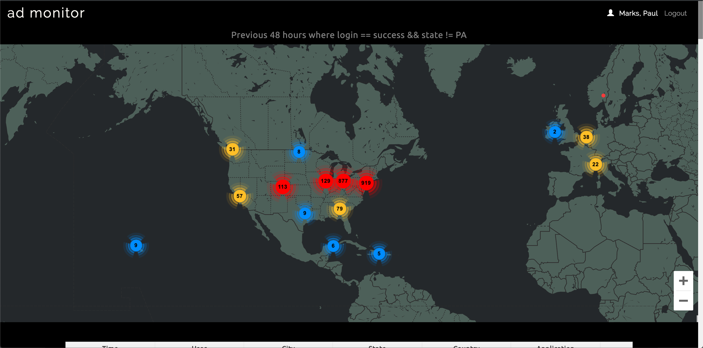

# AD Monitor

AD Monitor is a monitoring application used by the Department of Innovation & Performance at the City of Pittsburgh.  It provides a map & table interface for browsing the previous 48 hours of successful login events to City services, where the login event originated from somewhere outside of Pennsylvania.  Login events can be drilled down, and all attributes contained in the [signIn](https://docs.microsoft.com/en-us/graph/api/resources/signin?view=graph-rest-1.0) object can be inspected.

AD Monitor interfaces with two services: (1) an Azure storage container via [az-table](https://github.com/CityofPittsburgh/az-table), where the past 48 hours of login events are parked and (2) the Microsoft Graph API via [active-directory](https://github.com/CityofPittsburgh/active-directory) to call up complete [signIn](https://docs.microsoft.com/en-us/graph/api/resources/signin?view=graph-rest-1.0) records.



## A note on boilerplate

The bones of AD Monitor are shared across all client applications developed by Paul Marks for the City of Pittsburgh.  For more in-depth documentation on the structure,  design choices, authentication flow, and installation procedures for this application, please see the documentation for the [boilerplate](https://github.com/CityofPittsburgh/react-typescript-boilerplate).

This README will focus only on the components of this application that are unique to AD Monitor.

## Structure
    ...
    app
    ├── src                         
        ├── components        
            |── fullEventRecord     # Fetches and returns the complete signIn object as inspectable JSON 
            |── home                # Loads the store, returns map & table of events
            |── loginsPerLocation   # Modal returns table of login activity at selected location
            |── map                 # Map of events
            |── table               # Table of events
        ├── store                   
            |── events              # persists 48 hours of login events originating from outside of PA

## Running Locally

### Prerequisites

* [Node.js](https://nodejs.org) - JS runtime
* .env - See .env.example for all required secrets

### Installation
```
git clone https://github.com/CityofPittsburgh/ad-monitor
cd ad-monitor
// first, install dependencies for the server
npm install
// then, install dependencies for the client
cd app
npm install
// to run the app locally and bypass auth
npm start
// to bundle the app for deployment
npm run build
// to run the app from the minified build, with auth workflow
cd ..
node server.js
```

## Deployment

Both staging and production services are hosted in Azure.  Application is deployed directly from github, and can be triggered either (a) through the Azure GUI, (b) through the [CLI](https://docs.microsoft.com/en-us/cli/azure/webapp/deployment/source?view=azure-cli-latest#az-webapp-deployment-source-sync), or (c) through the [proxy service](https://github.com/CityofPittsburgh/azure-proxy).

For complete documentation on the azure environment, see [here](https://github.com/CityofPittsburgh/all-things-azure.git).

## License

This project is licensed under the MIT License - see the [LICENSE.md](LICENSE.md) file for details